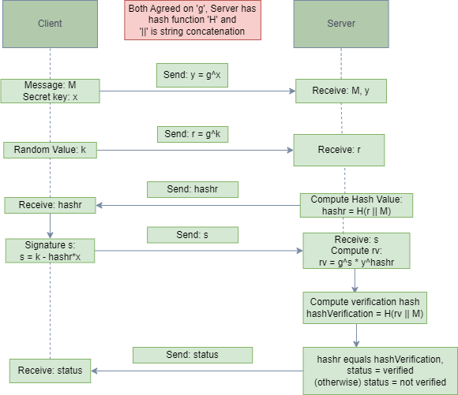
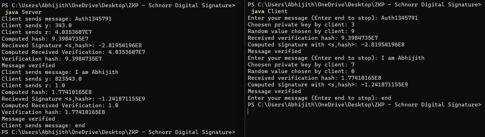

# ZKP: Schnorr Digital Signature

#### This is an implementation of the Zero Knowledge Proof: Schnorr Digital Signature for Message verification in a Client - Server simulation using Java. The following is the flowchart of the protocol (How I understood it) and is very similar to the idea of ZKP: Fiat Shamir but additionally we use Hashing here.



## How to run

* First clone the repository or download the files
* Compile the java program via the command:
````
> javac Client.java
> javac Server.java
````
* In two different terminals on the same directory run Server first and then the Client file using the commands:
````
> java Server
````
````
> java Client
````

## Output



## Modifications in Key Generation, Power Calculations and Hashing used
* Here we assign the keys and random selected value purely at random compared to the original algorithm. 
* Binary Exponentiation is used to calculate the powers of the number in log time.
* String Hashing is done via polynomial rolling hash function.
* We find 'x' here in server and calculate 'rv' via power arithmetic as some computations might overflow for any data type assigned via the original method.

## References
* [Understanding the Protocol](https://en.wikipedia.org/wiki/Schnorr_signature)
* [Polynomial Rolling Hash](https://cp-algorithms.com/string/string-hashing.html)
* [Binary Exponentiation](https://cp-algorithms.com/algebra/binary-exp.html)

